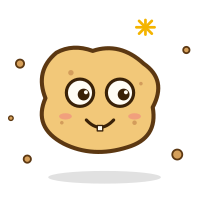

# Crumb (of an agent)
Crumb is a small, handwritten, self-improving agent. You can use it to improve itself and progressively do complex tasks.

The goal of the project is to learn how to write a very simple agent that can improve itself and hot reload so improvements show up as user chats with it. It's a simple hello world for self improving agent harness.

The demo shows how the agent can improve itself into a nice TUI while running.

## How to run

1. Clone/Download the repo
2. Install [Bun.js](https://bun.com)
3. Run `bun main.ts`

## Goals

The goal of the project is

* All code is hand written
* Keep the code quickly readable for humans (currently under 200 LOC)
* No external libraries allowed except for what comes with Bun

## Axioms

Before building the project I had the following axioms

* Models are reliable enough in outputting valid code that hot reloading can be done
* Running Bash command is the primarily tool for agent to have (or build) wide capabilities
* Agents are now good at instruction following so multi-turn over decent amount of iterations don't go off track
* Prefer adding to prompt than adding code for feature and let the agent rip, will yield in more capabilities

## Why Bun?

Bun has a good set of libraries out of box with good ergonomics, which makes the goal of no libraries allowed possible. Primarily running bash and managing/creating worker process is easier, allowing us to build hot-reloading capabilities.

## Contributions

PRs wont be accepted, to keep the simplicity of the project. Any suggestions to improve or simplify while still meeting the goals, please create an issue.